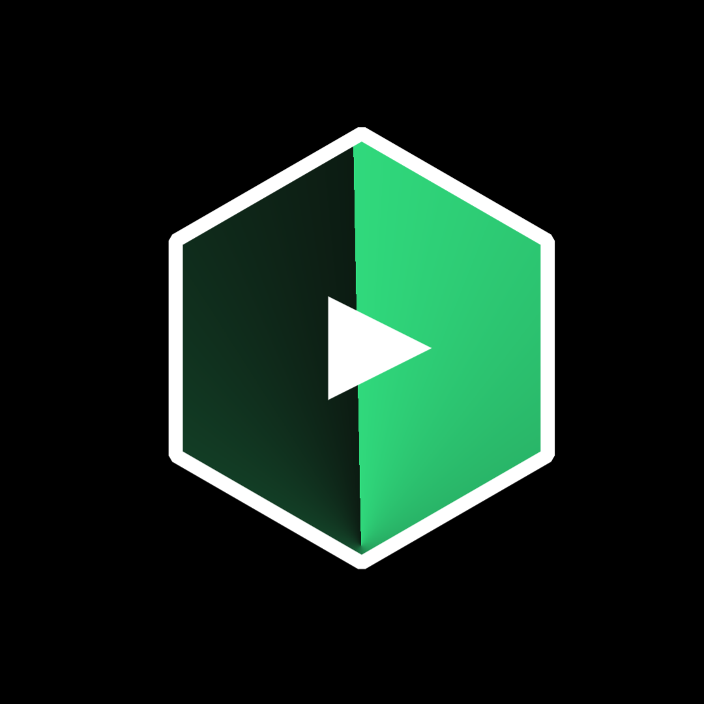

<p align="center">
  
</p>

<h1 align="center">MOVIX</h1>
<p align="center">
  <strong>Movies & music — one universe.</strong><br>
  A premium Flutter app for streaming films and lossless music,<br>
  wrapped in a cinematic green-dark interface. <sub>(codename: <em>Nebula</em>)</sub>
</p>

<p align="center">
  <a href="#"></a>
  <a href="#"></a>
  <a href="https://github.com/neerajkumar9631490-cloud/nebula"></a>
  <a href="https://github.com/neerajkumar9631490-cloud/nebula/commits/main"></a>
  <a href="https://github.com/neerajkumar9631490-cloud/nebula/stargazers"></a>
</p>

<p align="center">
  🎬 Multi-source movies &nbsp;·&nbsp; 🎵 FLAC lossless music &nbsp;·&nbsp; 📥 Offline downloads &nbsp;·&nbsp; 🌌 Green-dark UI
</p>

---

### 📖 Table of Contents
- [✨ Features](#-features)
- [📱 Screenshots](#-screenshots)
- [🎬 Movie Engine](#-movie-engine)
- [🎵 Music Engine](#-music-engine)
- [🖼️ UI & Design](#️-ui--design)
- [🏗️ Project Structure](#️-project-structure)
- [🚀 Build From Source](#-build-from-source)
- [🗺️ Roadmap](#️-roadmap)
- [❓ FAQ](#-faq)
- [🤝 Contributing](#-contributing)
- [⚖️ Disclaimer](#️-disclaimer)

---

## ✨ Features

| | Feature | Description |
|---|---------|-------------|
| 🎬 | **Multi-Source Movie Engine** | Browse, search and open full detail pages with true 16:9 backdrops, posters and an in-place source picker — pick a source, play directly. |
| 🎞️ | **Full Movie Mode** | One-tap "Full Movie" pill filters straight to complete features — no clip hunting. |
| 🎵 | **Lossless Music Stack** | Qobuz/Eclipse FLAC resolver with token refresh & best-match scoring, plus a YouTube HQ chain (InnerTube extractor, rate-limit guard, CDN headers, smart fallbacks). |
| 📝 | **Synced Lyrics** | LRCLIB synced + plain lyrics with LRC parsing — the active line follows playback in real time. |
| 📥 | **Offline Downloads** | Atomic-write download queue with cover cache for both movies and music. Watch & listen with zero connection. |
| 🔀 | **Seamless Source Switching** | FLAC ↔ YouTube source switch with in-place reload and live quality badges in the player. |
| 🌌 | **Premium Green-Dark UI** | An editorial, cinematic interface — home rails, hero status cards, hairline dividers, zero text overlap. |
| 📚 | **Library** | Your saved movies & music with per-item source selection and instant playback. |

---

## 📱 Screenshots

<p align="center">
  
  
  
</p>
<p align="center">
  
  
</p>
<p align="center">
  <sub>The green-dark Nebula interface — browse, detail, player, music & library.</sub>
</p>

---

## 🎬 Movie Engine

- **Detail hero done right** — landscape backdrops fill a 16:9 banner with zero crop; portrait posters render fully visible on a gradient scrim. Pin-collapse navigation included.
- **In-place source picker** — Detail and Library choose a source in place, then play directly. No detour pages.
- **Home rails** with two-line heads (title + tracked-source eyebrow) so you always know where a title resolves from.

## 🎵 Music Engine

- **Qobuz / Eclipse lossless resolver** — token refresh, best-match scoring, FLAC quality badges.
- **YouTube HQ chain** — InnerTube extractor → rate-limit guard → CDN headers → ConvertYTMP3 fallback.
- **Deezer proxy fallback** for geo-restricted tracks, plus extended featured sections.
- **Player UI** — quality badge, segmented source control, and a synced-lyrics card.

## 🖼️ UI & Design

> One palette. One type system. Zero overlap.

- Cinematic **green-on-black** nebula theme across every screen.
- Editorial **Settings**: display header, hero status card, grouped 62px rows with tinted icon tiles, working music-quality selector.
- Unified 10px-radius badges and `Expanded + ellipsis` text rows — long titles can never collide with actions.

---

## 🏗️ Project Structure

```
nebula/
├── .github/
│   └── workflows/        # CI — automated builds
├── assets/               # branding (logo.png) & media
├── lib/                  # full Flutter source
│   ├── movies/           #   detail, source picker, library
│   ├── music/            #   resolvers, player, lyrics
│   ├── downloads/        #   offline queue + cover cache
│   └── ui/               #   green-dark design system
├── pubspec.yaml          # Flutter manifest & dependencies
└── .gitignore
```

---

## 🚀 Build From Source

**Requirements:** Flutter SDK 3.x · Dart · Android SDK (or Xcode for iOS)

```bash
# 1 · Clone
git clone https://github.com/neerajkumar9631490-cloud/nebula.git
cd nebula

# 2 · Fetch dependencies
flutter pub get

# 3 · Build the APK
flutter build apk --release
```

Output → `build/app/outputs/flutter-apk/app-release.apk` 🎉

> [!TIP]
> Packaged builds will be published on the
> **[Releases page](https://github.com/neerajkumar9631490-cloud/nebula/releases)** — star the repo to get notified when v1.0 drops.

---

## 🗺️ Roadmap

- [x] Multi-source movie engine with in-place picker
- [x] Lossless music stack (FLAC + YouTube HQ + Deezer fallback)
- [x] Player-synced lyrics (LRCLIB)
- [x] Offline download queue with atomic writes
- [x] Premium green-dark UI pass
- [ ] Chromecast / external casting
- [ ] Tablet & landscape layouts
- [ ] iOS release build
- [ ] Watchlist cloud sync

---

## ❓ FAQ

<details>
<summary><strong>What is Movix?</strong></summary>
A Flutter-built universe for movies and music: multi-source film playback, lossless audio, synced lyrics and offline downloads — in one cinematic app.
</details>

<details>
<summary><strong>Where does content come from?</strong></summary>
Movix hosts nothing. It aggregates publicly available third-party sources and resolves the best playable stream for you.
</details>

<details>
<summary><strong>Is it free?</strong></summary>
Yes — free for personal, non-commercial use. The source is right here.
</details>

<details>
<summary><strong>Why "Nebula"?</strong></summary>
That's the repo codename. The product you see on screen is <strong>Movix</strong> — the nebula is just where it was born. 🌌
</details>

---

## 🤝 Contributing

Bug reports, ideas and pull requests are welcome —
**[open an issue](https://github.com/neerajkumar9631490-cloud/nebula/issues)** or fork & send a PR.
If Movix made your movie nights better, **leave a ⭐ star**.

---

## ⚖️ Disclaimer

> Movix (Nebula) **does not host, store or distribute any media**. It is an independent client that aggregates third-party sources, provided for **personal and educational use**. All product names, logos and brands are property of their respective owners. Please respect content creators and applicable laws in your region.

---

<p align="center">
  <sub>Born in the Nebula · Built with Flutter · © 2026 Movix</sub>
</p>
